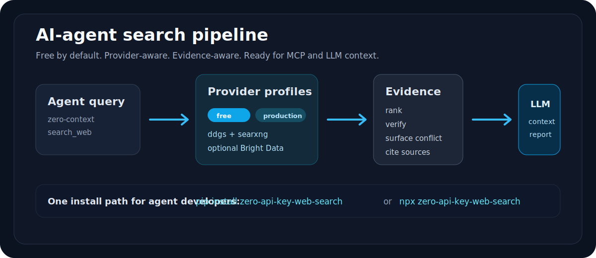
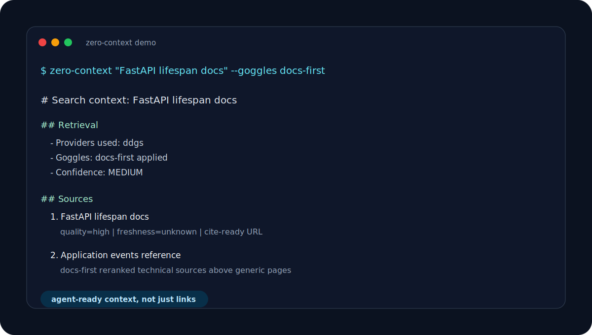

<div align="center">
  <h1>Zero-API-Key Web Search</h1>
  <p><strong>Search infrastructure for AI agents.</strong></p>
  <p><em>Free by default. MCP-ready. LLM-context aware. Production-grade when you opt in.</em></p>

  [](https://pypi.org/project/zero-api-key-web-search/)
  [](https://python.org)
  [](https://modelcontextprotocol.io/)
  [](./tests)
  [](LICENSE)

  <br><br>
  
</div>

---

## Abstract

Zero-API-Key Web Search is a local-first, MCP-native search and evidence-verification toolkit for AI agents. It provides live web search, LLM-optimized context extraction, claim verification with weighted evidence scoring, and citation-ready evidence reports — all without requiring an API key by default. The verification model (`evidence-aware-heuristic-v3`) classifies sources as supporting, conflicting, or neutral using keyword overlap, domain-quality heuristics, freshness, and optional page-aware rescoring. This project does not perform fact-level proof or logical entailment; it is a signal amplifier for agent grounding decisions.

## Introduction

AI agents that rely on raw search retrieval often produce ungrounded or confidently wrong outputs because search results provide links, not evidence. Zero-API-Key Web Search bridges this gap by layering verification and source-quality scoring on top of live search. The research question it addresses is: Can heuristic evidence scoring and source-quality weighting reduce ungrounded agent outputs compared to raw search retrieval?

## Why Agents Use It

A single install gives your agent live search, page reading, claim verification, and citation-ready context without requiring an API key by default.

| Agent job | Command | What the agent gets |
| --- | --- | --- |
| Ground an answer | `zero-context "FastAPI lifespan docs"` | compact Markdown context with citations |
| Verify a claim | `zero-verify "Python 3.13 is the latest stable release"` | supported / contested / likely false verdict |
| Build an evidence report | `zero-report "AI regulation news"` | rationale, source digest, warnings, next steps |
| Serve an MCP client | `zero-mcp` | `search_web`, `llm_context`, `browse_page`, `verify_claim`, `evidence_report` |

<p align="center">
  
</p>

## Quick start

```bash
pip install zero-api-key-web-search

# Search the web
zero-search "Python 3.13 release" --json

# Inspect provider options
zero-search providers

# Build citation-ready LLM context
zero-context "Python 3.13 stable release" --goggles docs-first

# Read a page
zero-browse "https://docs.python.org/3/whatsnew/" --json

# Verify a claim
zero-verify "Python 3.13 is the latest stable release" --deep --json

# Full evidence report
zero-report "Python 3.13 stable release" \
  --claim "Python 3.13 is the latest stable release" --deep --json
```

Legacy CLI aliases (`search-web`, `browse-page`, `verify-claim`, `evidence-report`) also work.

Node-based agent runtimes can use the npm wrapper. The wrapper source is included in this repository; see [docs/npm-package.md](docs/npm-package.md).

## The 30-Second Pitch

- **Zero-key default**: useful immediately for local agents, evals, demos, and prototypes.
- **MCP-native**: works as a reusable tool server for Claude Code, Cursor, Copilot-style clients, Codex, Gemini, OpenClaw, and other MCP-compatible runtimes.
- **LLM-context first**: `zero-context` returns context a model can actually use, not just a pile of links.
- **Evidence-aware**: `zero-verify` and `zero-report` preserve support, conflict, source quality, freshness, and domain diversity (within the heuristic boundary described in `docs/trust-model.md`).
- **Provider-aware**: start free with `ddgs`, add self-hosted `searxng`, or opt into Bright Data for production reliability and geo-targeting.

## Why this over a plain search wrapper?

| Feature | Plain search | Zero-API-Key Web Search |
| --- | --- | --- |
| Live search results | ✅ | ✅ |
| News / images / videos / books | ❌ | ✅ |
| Region & time filtering | ❌ | ✅ |
| Full-page text extraction | ❌ | ✅ |
| Claim verification with evidence scores | ❌ | ✅ |
| Supporting vs. conflicting evidence | ❌ | ✅ |
| Citation-ready evidence reports | ❌ | ✅ |
| Dual-provider cross-validation | ❌ | ✅ |
| API key required | Often | **Never by default** *(Default provider is DuckDuckGo; no key needed. Production providers require configuration.)* |
| Cost | Sometimes | **Free by default** |

## Compare the Shape

| Project shape | Best at | Tradeoff |
| --- | --- | --- |
| Plain search wrapper | returning links quickly | leaves grounding, citation shaping, and conflict handling to the agent |
| Hosted search API | managed reliability and scale | usually requires an account/key from the first request |
| Zero-API-Key Web Search | local agent search infrastructure with optional production providers | default results depend on free upstreams unless you add SearXNG or Bright Data |

This project is not trying to be a hosted search engine. It is the missing search/evidence layer inside agent runtimes.

## MCP server

Works with Claude Code, Cursor, Copilot, and any MCP-compatible agent:

```json
{
  "mcpServers": {
    "zero-api-key-web-search": {
      "command": "zero-mcp"
    }
  }
}
```

For npm/npx-based MCP launchers after npm publication:

```json
{
  "mcpServers": {
    "zero-api-key-web-search": {
      "command": "npx",
      "args": ["zero-api-key-web-search", "zero-mcp"]
    }
  }
}
```

Six tools exposed: `list_providers`, `search_web`, `llm_context`, `browse_page`, `verify_claim`, `evidence_report`.

## Platform support

| Platform | Status | Entry point |
| --- | --- | --- |
| **CLI** | Ready | `zero-search`, `zero-context`, `zero-browse`, `zero-verify`, `zero-report` |
| **MCP** | Ready | `zero-mcp` |
| **Claude Code** | Ready | `.claude/skills/zero-api-key-web-search/SKILL.md` |
| **Gemini** | Ready | `GEMINI.md` + `.gemini/SKILL.md` |
| **Cursor** | Ready | `.cursor/rules/zero-api-key-web-search.md` |
| **Copilot** | Ready | `.github/copilot/instructions.md` |
| **Codex** | Ready | `.codex/SKILL.md` |
| **Continue** | Ready | `.continue/skills/zero-api-key-web-search/SKILL.md` |
| **Manus** | Ready | Root `SKILL.md` + `docs/manus.md` |
| **Kiro** | Ready | `.kiro/steering/zero-api-key-web-search.md` |
| **OpenClaw** | Ready | `zero_api_key_web_search/skills/SKILL.md` |

## How verification works

`zero-verify` uses the **evidence-aware heuristic v3** model:

1. Search for the claim across available providers
2. Score each source on keyword overlap, source quality, freshness
3. Classify as supporting, conflicting, or neutral
4. Optionally fetch top pages for deeper page-aware analysis
5. Render a verdict with confidence and evidence breakdown

| Verdict | Meaning |
| --- | --- |
| `supported` | Strong evidence, low conflict |
| `likely_supported` | Leans positive, not decisive |
| `contested` | Support and conflict both meaningful |
| `likely_false` | Conflict strong, support weak |
| `insufficient_evidence` | Too weak for any firmer verdict |

This is a heuristic evidence classifier, not a proof engine. See `docs/trust-model.md` for details and limitations, `docs/verification-model.md` for signal definitions, and `docs/benchmarks.md` for regression results.

## Free dual-provider setup

Default install uses DuckDuckGo. For stronger cross-validated evidence, add a free self-hosted SearXNG:

```bash
./scripts/start-searxng.sh
export ZERO_SEARCH_SEARXNG_URL="http://127.0.0.1:8080"
./scripts/validate-free-path.sh
```

Or with Docker Compose:

```bash
cp .env.searxng.example .env
docker compose -f docker-compose.searxng.yml up -d
```

Full guide: [docs/searxng-self-hosted.md](docs/searxng-self-hosted.md).

## Agent search controls

Provider profiles make backend choice explicit:

| Profile | Providers | Best for |
| --- | --- | --- |
| `free` | `ddgs` | zero-setup local use |
| `free-verified` | `ddgs`, `searxng` | free cross-validation |
| `production` | `brightdata` | production reliability and geo-targeting |
| `max-evidence` | `ddgs`, `searxng`, `brightdata` | maximum provider diversity |

```bash
zero-search "FastAPI lifespan docs" --profile free-verified --goggles docs-first
zero-context "FastAPI lifespan docs" --profile free --goggles docs-first
zero-report "AI regulation news" --profile production --json
```

Built-in Goggles-lite presets:

| Goggles | Effect |
| --- | --- |
| `docs-first` | boosts docs, API, support, release-note, and official-looking sources |
| `research` | boosts academic, institutional, paper, and study-oriented sources |
| `news-balanced` | boosts reporting/analysis signals and demotes low-context aggregators |

You can also pass a JSON file to `--goggles` with `boost_domains`, `block_domains`, `demote_domains`, and `boost_title_terms`.

Full guide: [docs/agent-search-controls.md](docs/agent-search-controls.md).

More agent integration material:

- [Agent Developer Guide](docs/agent-developer-guide.md)
- [Demo Transcript](examples/demo-transcript.md)
- [Launch Kit](docs/launch-kit.md)

## Optional Bright Data provider

The default path stays free and zero-key. For production agents that need higher reliability, structured SERP data, geo-targeted results, or stronger cross-provider verification, enable the optional Bright Data provider.

```bash
export ZERO_SEARCH_BRIGHTDATA_API_KEY="..."
# Optional if your Bright Data SERP zone is not named web_search:
export ZERO_SEARCH_BRIGHTDATA_ZONE="web_search"

zero-search providers
zero-search "AI regulation news" --provider brightdata --type news --region us-en --json
zero-report "Tesla Q1 2026 deliveries" \
  --claim "Tesla deliveries increased year over year" \
  --provider ddgs --provider brightdata --deep --json
```

New Bright Data users can sign up here: <https://get.brightdata.com/h21j9xz4uxgd>.

| Provider | Best for |
| --- | --- |
| `ddgs` | zero-setup local search |
| `searxng` | free self-hosted cross-validation |
| `brightdata` | production-grade, geo-targeted, structured SERP evidence |

## Evidence report example

```json
{
  "verdict": "contested",
  "confidence": "MEDIUM",
  "executive_summary": "Evidence is split...",
  "verdict_rationale": ["Source A supports...", "Source B contradicts..."],
  "coverage_warnings": ["Single-provider evidence path."],
  "source_digest": [
    {"title": "...", "url": "...", "classification": "supporting", "evidence_strength": 3}
  ],
  "next_steps": ["Add a second provider for cross-validation."]
}
```

## Architecture

```
zero_api_key_web_search/
  core.py              # UltimateSearcher — search, verify, report engine
  browse_page.py       # Readability-style page text extraction
  mcp_server.py        # MCP server (6 tools)
  transport.py         # SSL/TLS helpers
  search_web.py        # CLI: zero-search
  context.py           # CLI: zero-context
  browse_page.py       # CLI: zero-browse
  verify_claim.py      # CLI: zero-verify
  evidence_report.py   # CLI: zero-report
  providers/
    base.py            # SearchProvider protocol (sync + async)
    ddgs.py            # DuckDuckGo provider
    searxng.py         # SearXNG provider
    brightdata.py      # Optional Bright Data SERP provider
  skills/
    SKILL.md           # Bundled OpenClaw skill
```

Key engineering features:

- **Circuit breaker**: Trips after 3 consecutive provider failures, auto-resets after 60s
- **Async support**: `asearch()` for concurrent provider calls via `asyncio.gather`
- **Structured logging**: Configurable logging at search/verify/report entry points
- **Readability heuristic**: Semantic HTML5 + ARIA roles + text density scoring
- **Baseline comparison**: Majority-vote and keyword-count baselines in reports
- **Sub-claim decomposition**: Targeted sub-queries for independent evidence gathering

## Installation

```bash
pip install zero-api-key-web-search
```

Python 3.10+ required. No API keys, no accounts, no configuration needed.

Optional npm wrapper source:

```bash
npm pack --dry-run
```

## Development

```bash
pip install -e ".[dev]"
python -m pytest tests/ -q           # 98 tests
ruff check zero_api_key_web_search/ tests/
pyright zero_api_key_web_search/     # 0 errors
coverage report --fail-under=80       # 85% coverage
```

## Verification for ecosystem reviewers

1. `zero-report "Python 3.13 stable release" --claim "Python 3.13 is the latest stable release" --deep --json`
2. [docs/ecosystem-readiness.md](docs/ecosystem-readiness.md)
3. [docs/gemini-submission-checklist.md](docs/gemini-submission-checklist.md)
4. [docs/trust-model.md](docs/trust-model.md)

## License

MIT License.
