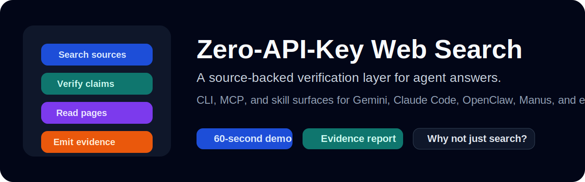

<div align="center">
  
  <h1>Cross-Validated Search</h1>
  <p><strong>Evidence-aware web search, browsing, and claim verification for AI agents.</strong></p>
  <p><em>CLI + MCP + skill surfaces for Gemini, OpenClaw, and other agent runtimes.</em></p>

  [](https://pypi.org/project/cross-validated-search/)
  [](https://python.org)
  [](https://modelcontextprotocol.io/)
  [](https://glama.ai/mcp/servers/wd041216-bit/free-web-search-ultimate)
  [](LICENSE)
</div>

Cross-Validated Search is an evidence-aware verification layer for AI agents. It combines live web search, page reading, and claim checking so an agent can surface supporting evidence, conflicting evidence, and source-backed confidence before presenting factual answers.

> Canonical names in v16: package `cross-validated-search`, module `cross_validated_search`, and MCP command `cross-validated-search-mcp`. Legacy `free_web_search` imports and `free-web-search-mcp` remain available as compatibility aliases.

> Recommended free path: `ddgs + self-hosted SearXNG`. Configure `CROSS_VALIDATED_SEARCH_SEARXNG_URL` to unlock a free second provider and stronger evidence reports.

## Indexer Quick Review

If you are reviewing this repo for collection or ecosystem inclusion, the fastest path is:

1. verify the flagship workflow:
   `evidence-report "Python 3.13 stable release" --claim "Python 3.13 is the latest stable release" --deep --json`
2. review the ecosystem contract:
   [docs/ecosystem-readiness.md](docs/ecosystem-readiness.md)
3. review the free dual-provider bootstrap:
   [docs/searxng-self-hosted.md](docs/searxng-self-hosted.md)
4. review Gemini gallery readiness:
   [docs/gemini-submission-checklist.md](docs/gemini-submission-checklist.md)

## 60-second verification

Install and verify the public surface:

```bash
pip install cross-validated-search
search-web "Python 3.13 release" --json
verify-claim "Python 3.13 is the latest stable release" --deep --max-pages 2 --json
evidence-report "Python 3.13 stable release" --claim "Python 3.13 is the latest stable release" --deep --json
```

Typical `evidence-report` JSON shape:

```json
{
  "verdict": "contested",
  "confidence": "MEDIUM",
  "coverage_warnings": [
    "Single-provider evidence path. Add another provider when possible."
  ],
  "analysis": {
    "report_model": "evidence-report-v2",
    "provider_diversity": 1,
    "page_aware": true,
    "support_score": 1.42,
    "conflict_score": 0.61,
    "coverage_warning_count": 1
  }
}
```

If you are evaluating the repo for ecosystem collection, start with [docs/ecosystem-readiness.md](docs/ecosystem-readiness.md).

## Why this exists

Most search wrappers stop at “here are some results.” This repository goes one step further:

- returns structured search results with citations
- reads full pages when snippets are not enough
- classifies evidence as supporting, conflicting, or neutral
- generates a higher-level evidence report with citation-ready sources and next steps
- exposes explainable confidence signals instead of a black-box claim
- works across CLI, MCP, Gemini, OpenClaw, and other agent workflows

## Current capabilities

### `search-web`

Use live search for factual or time-sensitive queries.

```bash
search-web "Python 3.13 release"
search-web "OpenAI release news" --type news --timelimit w
search-web "人工智能最新进展" --region zh-cn --json
```

### `browse-page`

Read the full text of a URL when snippets are not enough.

```bash
browse-page "https://example.com/article"
browse-page "https://example.com/article" --json
```

### `verify-claim`

Check whether a claim looks supported, contested, likely false, or still under-evidenced.

```bash
verify-claim "Python 3.13 is the latest stable release"
verify-claim "OpenAI released GPT-5 this week" --timelimit w --json
verify-claim "Python 3.13 is the latest stable release" --with-pages --max-pages 2
```

### `evidence-report`

Generate a compact report that combines search, verification, citations, and follow-up guidance.

```bash
evidence-report "Python 3.13 stable release"
evidence-report "Python 3.13 stable release" --claim "Python 3.13 is the latest stable release" --deep --json
```

The report now includes:

- verdict rationale that explains why the score landed where it did
- stance summary buckets for supporting, conflicting, and neutral evidence
- coverage warnings when provider diversity, domain diversity, or page-aware depth look weak
- citation-ready source digests and recommended next steps

## Free dual-provider setup

If you want the strongest free setup, self-host SearXNG and pair it with `ddgs`:

```bash
./scripts/start-searxng.sh
export CROSS_VALIDATED_SEARCH_SEARXNG_URL="http://127.0.0.1:8080"
./scripts/validate-free-path.sh
```

Or use the compose file directly:

```bash
cp .env.searxng.example .env
docker compose -f docker-compose.searxng.yml up -d
```

Full setup and validation guide: [docs/searxng-self-hosted.md](docs/searxng-self-hosted.md).

The current verification model is `evidence-aware-heuristic-v3`, and the flagship report surface is `evidence-report-v2`. Together they use:

- keyword overlap between the claim and returned evidence
- contradiction markers in titles and snippets
- source-quality heuristics
- source freshness when a parseable date exists
- domain diversity across the evidence set
- optional page text from top fetched sources
- optional provider diversity when a second provider is configured

Details and limitations are documented in [docs/trust-model.md](docs/trust-model.md).
For a quick product-level comparison with plain search wrappers, see [docs/why-not-just-search.md](docs/why-not-just-search.md).
The next calibration step is outlined in [docs/benchmark-plan.md](docs/benchmark-plan.md).

## Installation

```bash
pip install cross-validated-search
```

Or install from source:

```bash
git clone https://github.com/wd041216-bit/cross-validated-search.git
cd cross-validated-search
pip install -e .
```

Python 3.10+ is required.

## Platform support

| Surface | Status | Notes |
| --- | --- | --- |
| CLI | Yes | `search-web`, `browse-page`, `verify-claim`, `evidence-report` |
| MCP | Yes | `cross-validated-search-mcp` |
| Gemini CLI | Yes | `gemini-extension.json`, root `skills/`, and `.gemini/SKILL.md` |
| OpenClaw | Yes | `cross_validated_search/skills/SKILL.md` |
| Claude Code / Cursor / Continue / Copilot | Yes | Bundled skill and instruction files |

## Verification model

`verify-claim` returns one of five verdicts:

| Verdict | Meaning |
| --- | --- |
| `supported` | Strong support, low conflict, and enough domain diversity |
| `likely_supported` | Evidence leans positive but is not decisive |
| `contested` | Support and conflict both carry meaningful weight |
| `likely_false` | Conflict is strong and support is weak |
| `insufficient_evidence` | Evidence exists but is too weak for a firmer claim |

This is an evidence-aware heuristic system, not a fact-level proof engine. Today it still has three important limits:

- default install still starts with `ddgs`; the recommended collection-grade free path is `ddgs + self-hosted searxng`
- page-aware verification is optional and still heuristic rather than full-document entailment
- no benchmark-driven confidence calibration yet

## MCP example

Add the server to your MCP client:

```json
{
  "mcpServers": {
    "cross-validated-search": {
      "command": "cross-validated-search-mcp",
      "args": []
    }
  }
}
```

## Development

Run the test suite:

```bash
python -m unittest discover -s tests -v
```

Build distributables:

```bash
python -m build
```

Run deterministic benchmark regressions:

```bash
python benchmarks/run_benchmark.py
```

## Roadmap

The next upgrades needed for ecosystem-grade collection are:

1. calibrate provider weighting and add stronger provider-specific tests
2. improve page-aware verification beyond snippet and keyword heuristics
3. add benchmark fixtures and regression scoring
4. improve the flagship `evidence-report` workflow with richer source summarization and calibration

## License

MIT License.
